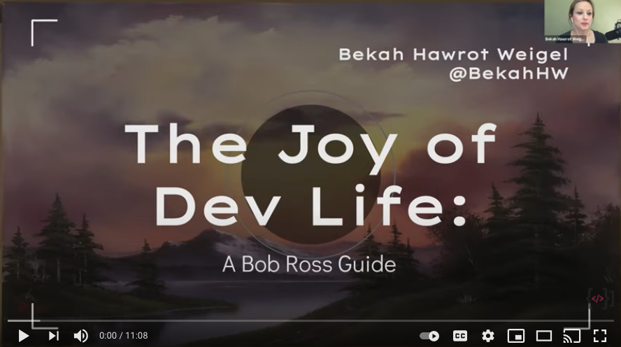

:coffee: Welcome to Virtual Coffee! :coffee:
======
[Virtual Coffee](https://virtualcoffee.io) is a laid-back conversation with developers twice a week. It's the conversation that keeps going in slack. It's the online events that support developers at all stages of the journey. It's the place you go to make friends. Anyone can join! Whether you're thinking about getting into tech or have been in it for decades.

Our Mission
------
Virtual Coffee's mission is to be a welcoming tech community that allows room for growth and mentorship at all levels, and to create meaningful opportunities for learning, leadership, and contribution for everyone.

[Sponsor Us!](https://github.com/sponsors/Virtual-Coffee)
------
Here are some of the things that sponsorship money will go to support:

* Twice-Weekly [Coffee Chats](https://virtualcoffee.io/events/)
* Member-led [Presentations and Workshops]( https://www.youtube.com/playlist?list=PLh9uT23TA65idCyc_orC85RefgY_-fKsG)
* A weekly [podcast](https://virtualcoffee.io/podcast/) sharing the stories of our members
* A monthly [newsletter](https://virtualcoffee.io/newsletter/) with Virtual Coffee news and interesting things our members are doing
* Our growing Slack community
* The Virtual Coffee [Co-Working Room](https://dev.to/virtualcoffee/how-the-virtual-coffee-coworking-room-works-2a89)
* [Lightning Talks](https://www.youtube.com/playlist?list=PLh9uT23TA65infGqUUaVibI0IssI0G6NY)
* The Virtual Coffee [Hacktoberfest Initiative](https://hacktoberfest.virtualcoffee.io)
and lots more!

Be sure to check out the [one-time](https://github.com/sponsors/Virtual-Coffee?frequency=one-time) sponsorship tiers for some more options!

Learn with us!
------

FAQs :pencil:
------
### How do I become a member?
To become a member of Virtual Coffee, all you need to do is attend [a Tuesday or Thursday Coffee](https://virtualcoffee.io/events/) and submit the form you'll receive at coffee.
### What's the code of conduct?
In order to create a welcoming and inclusive community, we pledge to make participation in our community a harassment-free experience for everyone, regardless of age, body size, visible or invisible disability, ethnicity, gender identity and expression, level of experience, education, socio-economic status, nationality, personal appearance, race, religion, or sexual identity and orientation.

[Read more](https://virtualcoffee.io/code-of-conduct) about how we enforce this and cultivate a community that assumes good intent.
### Can I contribute here on Github? :computer:
Absolutely! Check out our [open issues](https://github.com/Virtual-Coffee/virtualcoffee.io/issues) and [Contributing Guide](https://github.com/Virtual-Coffee/virtualcoffee.io/blob/main/CONTRIBUTING.md)!

If you're [a member](https://virtualcoffee.io/members/) don't foreget to [add yourself](https://github.com/Virtual-Coffee/virtualcoffee.io/issues/13).

Contact us!
------
If you have any questions or comments, please drop us a line at hello@virtualcoffee.io! :email:
